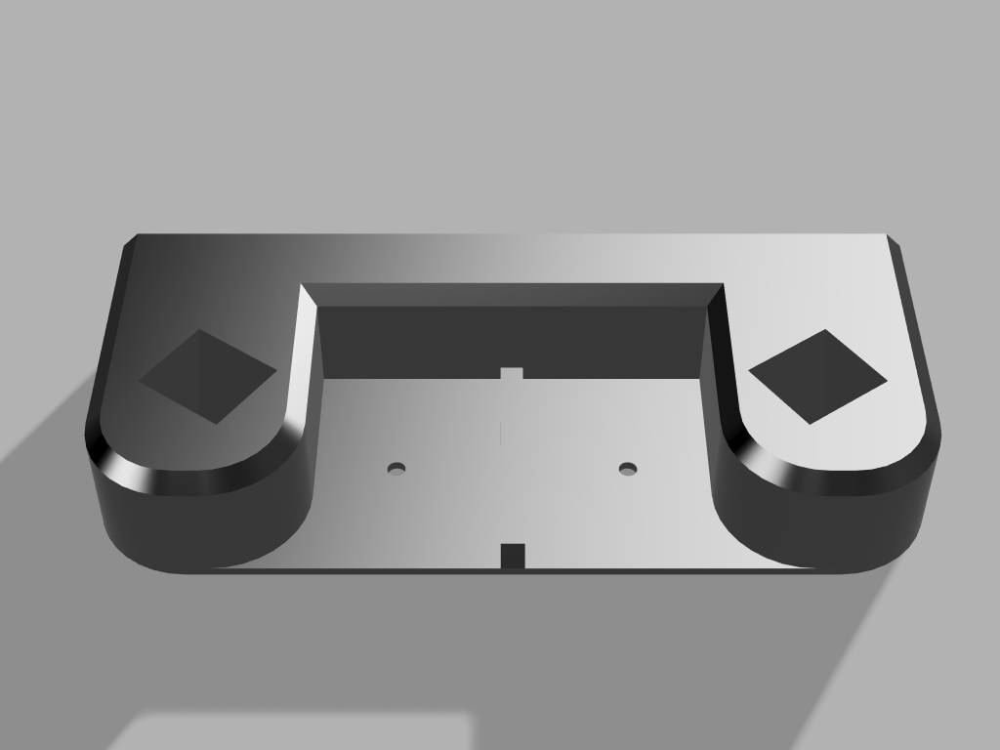
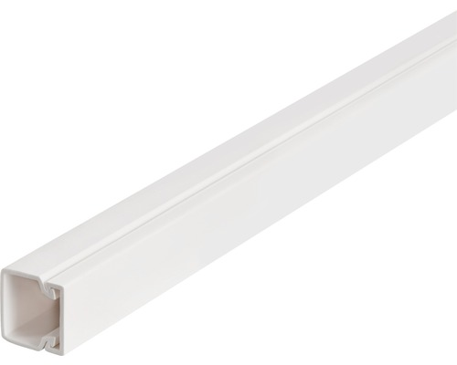
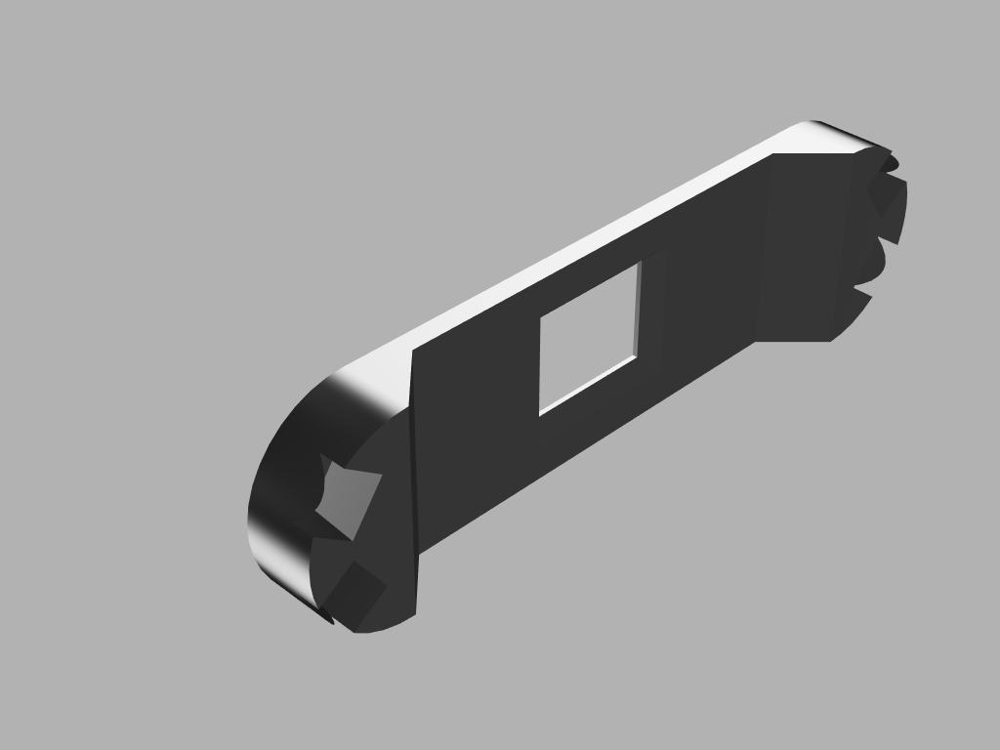
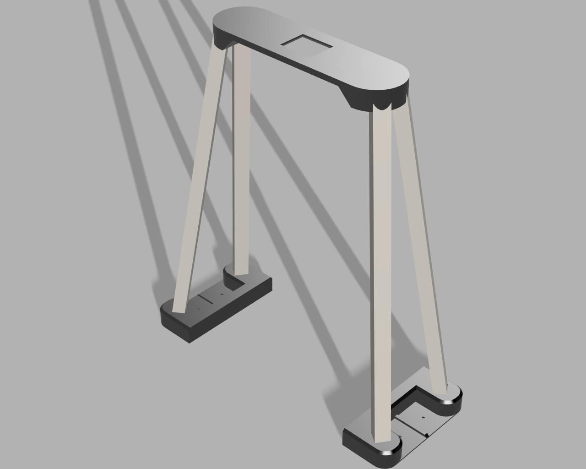

# 🤖 Bot Observer

**Bot Observer** je inteligentný systém na automatizované meranie času a vyhodnocovanie pretekov mobilných robotov. Aplikácia využíva knižnicu **OpenCV** na spracovanie obrazu v reálnom čase, čím nahrádza drahé časomerné brány jednoduchým Android zariadením.

---

## 📥 Inštalácia a prvé spustenie

Aplikácia je vyvíjaná ako closed-source projekt a je voľne dostupná výhradne prostredníctvom sekcie GitHub Releases. Momentálne nie je distribuovaná prostredníctvom Google Play Store.

### Postup inštalácie:
1.  **Stiahnutie:** Prejdite na GitHub v sekcii [Releases](https://github.com/Legionn-dev/BotObserver/releases) a stiahnite si najnovší `.apk` súbor.
2.  **Povolenie zdrojov:** V nastaveniach Androidu povoľte "Inštaláciu z neznámych zdrojov" pre váš prehliadač alebo správcu súborov.
3.  **Digitálny podpis:** Keďže aplikácia nemá komerčný digitálny podpis, systém **Google Play Protect** môže zobraziť varovanie.
    *   Kliknite na **"Viac informácií"** (More details).
    *   Zvoľte **"Inštalovať aj napriek tomu"** (Install anyway).
4.  **Povolenia:** Pri prvom spustení aplikácia vyžiada prístup ku **Kamere**. Toto povolenie je nevyhnutné pre fungovanie detekcie.

---

## 🚀 Navigácia a ovládanie aplikácie

### 1. Hlavná obrazovka (Dashboard)
Po úspešnom udelení povolení sa ocitnete na hlavnom paneli.

#### **Horná lišta (Top Bar)**
*   **🏆 Ikona Pohára (Results):** Presmeruje vás na obrazovku výsledkov. Dáta sú filtrované podľa aktuálne zvoleného režimu.
*   **⚙️ Ikona Nastavení:** Vysunie spodný panel (Bottom Sheet), kde konfigurujete parametre pretekov.
*   **🔄 Prepínač pohľadu (Color Mask):**
    *   *Normálny režim:* Vidíte reálny obraz s detekčnými bodmi.
    *   *Maska:* Vidíte binárny (čierno-biely) obraz, ktorý ukazuje, čo presne kamera deteguje ako cieľovú farbu. Ideálne pre kalibráciu osvetlenia.

#### **Náhľad kamery a Kalibrácia**
V strede obrazovky vidíte živý prenos. Po detekcii cieľovej čiary sa na obraze objavia **červené krúžky**. Tieto krúžky reprezentujú "virtuálne senzory".
*   Pre korektné meranie musí robot prejsť priamo cez tieto body.

#### **Štatistiky a Premenovanie**
V spodnej časti vidíte karty robotov.
*   **Premenovanie:** Kliknutím na text "ROBOT 1" alebo "ROBOT 2" sa otvorí dialógové okno, kde môžete zadať meno konkrétneho súťažiaceho.
*   Zobrazuje sa: Aktuálne kolo, Čas posledného kola a Celkový čas.

#### **Ovládací panel (Bottom Bar)**
1.  **START/STOP CAMERA:** Zapne/vypne spracovanie obrazu. Pred štartom pretekov musí byť kamera aktívna.
2.  **START RACE:** Spustí automatickú štartovaciu sekvenciu.
3.  **RESET (Ikona Refresh):** Okamžite vynuluje všetky časy a počítadlá kôl.

---

## 🏎️ Štartovacia sekvencia a Režimy

### Štartovací semafor
Po stlačení **START RACE** sa na celej obrazovke objaví semafor s 5 úrovňami svetiel (2x červená, 2x oranžová a 1x zelená). Tie sa postupne rozsvecujú v sekundových intervaloch. 
*   *Poznámka:* Časomiera začína plynúť okamžite po rozsvietení zeleného svetla (štart z miesta).

### Režimy pretekov
V nastaveniach si môžete vybrať:
*   **TRAINING:** Voľný režim. Nastavte si ľubovoľný počet robotov (1-2) a počet kôl (1-20).
*   **COMPETITION:** Fixné pravidlá pre oficiálne súťaže:
    *   **Time Trial:** 1 robot, 3 kolá. Systém vyhodnocuje najlepší celkový čas.
    *   **Sprint:** 2 roboti naraz, 5 kôl. Klasický head-to-head súboj.
    *   **Endurance:** 2 roboti naraz, 10 kôl. Test vytrvalosti.

---

## 📊 Vyhodnocovanie výsledkov

Aplikácia inteligentne ukladá históriu každej jazdy.
*   **Leaderboard (1 robot):** Ak jazdíte kategóriu pre jedného robota, uvidíte globálny rebríček. Ak ten istý robot (pod rovnakým menom) jazdil viackrát, v rebríčku sa zobrazí jeho najlepší výkon.
*   **Match History (2 roboti):** Pri súbojoch dvojíc vidíte históriu jednotlivých pretekov chronologicky, aby ste vedeli spätne určiť víťaza každého duelu.

---

## 🏗️ Príprava hardvéru a stojanu

Pre presné meranie musí byť telefón upevnený v stabilnej polohe kolmo nad štartovacou čiarou.

### Konštrukcia stojanu
Stojan sa skladá z troch hlavných častí, ktoré si môžete vytlačiť na 3D tlačiarni:

1.  **Podporné nohy (2 ks):** Umiestňujú sa na okraje dráhy.
    > 

2.  **Priečny nosník:** Bežná plastová elektrikárska lišta na káble (20x20mm) odrezaná na dĺžku 40cm, ktorá sa zasunie do nôh.
    > 

4.  **Univerzálny držiak (Top Mount):** Súčiastka, ktorá sa nasúva na lištu a pevne drží váš smartfón.
    > 

### Celková zostava
Takto vyzerá kompletne pripravené pracovisko:
> 

---

## 🛠️ Technické požiadavky a tipy
*   **Osvetlenie:** Pre najlepšiu detekciu zabezpečte rovnomerné osvetlenie bez silných tieňov na cieľovej čiare.
*   **Farba značky:** Aplikácia je prednastavená na detekciu **výraznej žltej farby** (HSV rozsah). Odporúčame umiestniť na hornú časť robota žltý štítok alebo kocku.
*   **Umiestnenie:** Červené body v náhľade by mali byť zarovnané s fyzickou štartovacou čiarou na dráhe.

---
*(Súbory pre 3D tlač nájdete v priečinku `/hardware/3d_models`)*
